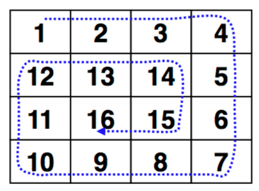

# BECamp12-1

## 作業說明：
- 這是一份程式語言基本的語法訓練，共有五題。
- 可以使用 PHP, Javascript, Typescript
- 請使用 TDD or BDD 流程開發
- 每一題請獨立開一個資料夾來寫
- 需撰寫 Comment 說明程式邏輯


## 作業目標：

訓練學員以下能力：
- 查找文件之能力
- PHP/JS/TS 基本語法運用
- 簡單邏輯鍛鍊
- 基本 Git/Github 能力
- 基本測試能力


## 題目一：
### Description
> Given an array of integers nums which is sorted in ascending order, and an integer target, write a function to search target in nums. If target exists, then return its index. Otherwise, return -1.

> [note 1] If there is an array that have one million number, which is like [1, 2, 3, ..., 100000000]. You should ensure that user can find 9,999,999 within 5ms.

### Sample I/O
```
Input: nums = [-1,0,3,5,9,12], target = 9
Output: 4

Input: nums = [-1,0,3,5,9,12], target = 10
Output: -1
```

## 題目二：
### Description
> Given a positive integer n, generate an n x n matrix filled with elements from 1 to n^2 in spiral order.



### Sample I/O
```
Input: n = 3
Output: [[1,2,3],[8,9,4],[7,6,5]]
```

## 題目三：
### Description
> A phrase is a palindrome if, after converting all uppercase letters into lowercase letters and removing all non-alphanumeric characters, it reads the same forward and backward. Alphanumeric characters include letters and numbers.
Given a string s, return true if it is a palindrome, or false otherwise.

### Sample I/O
```
Input: s = "race a car"
Output: false

Input: s = "A man, a plan, a canal: Panama"
Output: true
```

## 題目四：
### Description
> Given a string str, the task is to find the longest substring which is a palindrome.


### Sample I/O
```
Input: s = "babad"
Output: "bab"

Input: s = "cbbd"
Output: "bb"
```

## 題目五：
### Description
> Everyone knows that Hakkanese are very frugal.
In order to clearly find out what they have spent in the whole month and compare monthly expenses,
they ask you to calculate the growth (or maybe decrease) of the expenses between months.
But they are too diligent to pay you salary,
so you must do the job for them for free. QQ

> Given a integer T, represent the time they want to calculate the growth.
For next T lines, given you 2 integers, indicate the expense of two months.
Calculate the growth rate of the expenses.

> If the growth is >= 5%, then output "(#`Д´)ﾉ" (without quotes) after the growth,
or if the growth is <= -5%, then output "(ゝ∀･)b" (without quotes) after the growth.
Otherwise, output "\^o^/" (without quotes) after the growth.

> For example:
X=200, Y=177, then output "    -11.50% (ゝ∀･)b" (without quotes).

> [notice] Output contains only one line. Round to the second decimal places.
Output format: XXXX.YY% [Emoticons].
That is, if the integer part is not long enough, you should add spaces at the left of the integer.
For example: " -11.50% (ゝ∀･)b" or "   8.00% (#`Д´)ﾉ" (Without quotes). If the answer is -0.00%, you should output 0.00%.

### Sample I/O
```
Input: 200 177
Output:  -11.50% (ゝ∀･)b

Input: 99999 99999
Output:    0.00% \^o^/

Input: 10000 12345
Output:   23.45% (#`Д´)ﾉ

```
